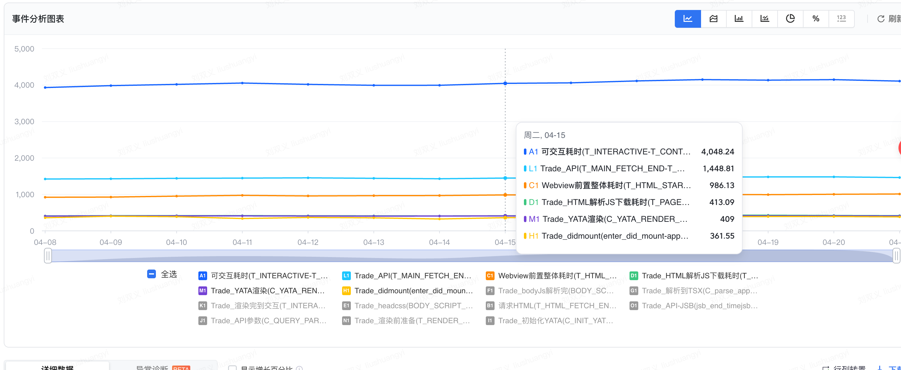
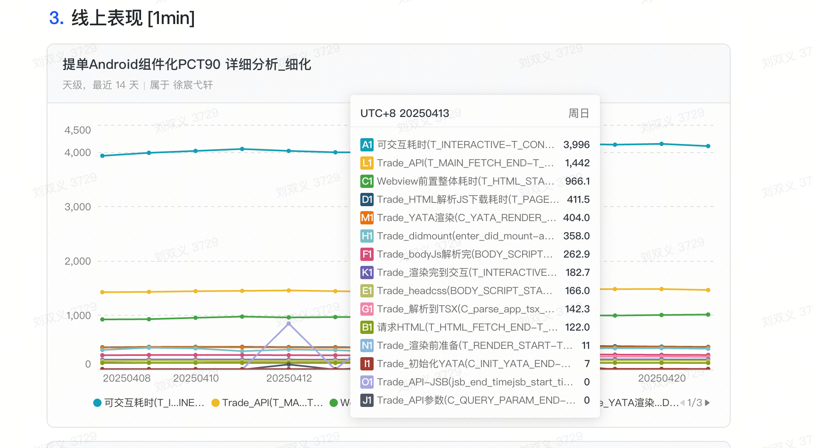
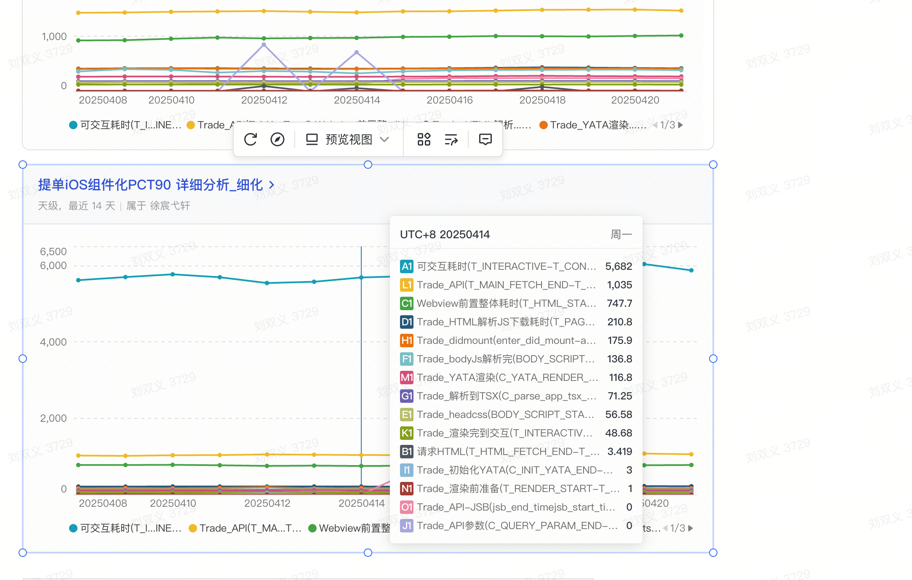
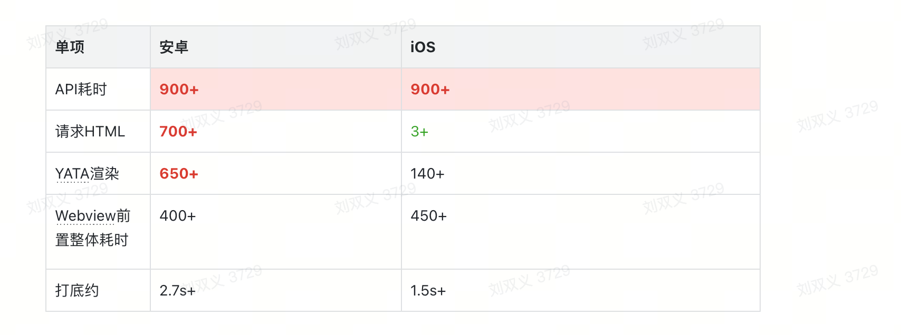
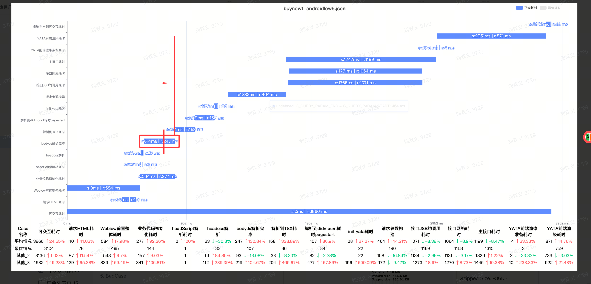
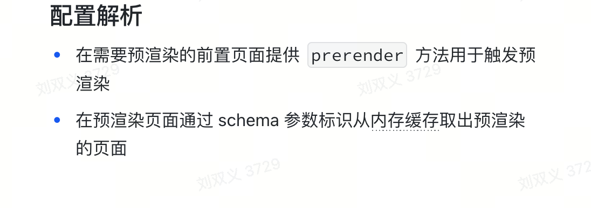

## 滴滴一面

### 项目相关
1. 为什么安卓比ios慢那么多tti： 
    1. 因为本身安卓的设备有很多低端机，拉低了整体的性能
    2. 本身安卓语言架构影响性能也会有所影响
2. lynx渲染原理：


### 八股文
1. type 和 interface 的区别
  - 声明合并： 
    - interface 多次定义同名接口会进行合并
    - type 不可重复定义同名类型，否则会报错
  - 扩展方式
    - interface 通过 extends 扩展接口
    - type 通过 & 组合多种类型
  - 灵活性
    - interface 仅可定义对象类型（函数、对象、类结构）
    - type 可定义任意类型：包括联合类型、原始类型 元组
  - 高级操作
    - type 可以支持映射类型、条件类型、typeof动态引用等高级操作
    ``` ts
      type Conditional<T> = T extends string ? 'string' : 'other';
      type MappedType = { [K in 'a' | 'b']: number };
      type User = typeof someExistingObject;     // 引用其他变量类型
    ```
  - 实现和继承
   - 类实现： 两者都可以通过 implement 来实现，但interface更符合语义
   - 泛型约束： 
   ``` ts
      interface Lengthwise { length: number; }
      function logLength<T extends Lengthwise>(arg: T) { ... }
    ```
2. 说说React diff原理
- 同级比较，不跨层级比较
- 比较同级节点类型，类型不同直接删除子树构建新树
- 通过key来标识同层级可复用的节点
- 相同类型的DOM元素：React 会 保留 DOM 节点，仅更新变化的属性。
- 相同的组件类型：如果组件类型相同，复用组件实例，触发更新生命周期，递归diff子节点
3. useCallback 和 useMemo 的区别
- useCallback可以认为是useMemo的语法糖
- usecallback： 缓存函数
- useMemo: 缓存一个高开销的计算结果


### coding
1. 实现函数
``` js
function f(b) {
  console.log(this.a, b);
} 
// Funtion.prototype.fakeBind
f.fakeBind = (a, inputB) => {
  if (inputB) {
    return () => f.bind({
      a: a.a
    })(inputB);
  }
  
  return (b) => f.bind({
    a: a.a
  })(b)
}

f.fakeBind({ a: 3 })(4); //=> 3, 4 
f.fakeBind({ a: 3 }, 10)(11); //=> 3, 10
```

2. 写一个 mySetInterVal(fn, a, b),每次间隔 a,a+b,a+2b,...,a+nb 的时间，然后写一个 myClear，停止上面的 mySetInterVal

``` js
function mySetInterval(fn, a, b) {
  const containerId = {
    timerId: null,
    count: 0,
    isClear: false;
  }

  function execFn = () => {
    const {
      timerId,
      isClear,
      time
    } = containerId
    if (isClear) return;
    fn();
    cotainerId.count = cotainerId.count + 1;
    const nextTime = a + cotainerId.count * b;
    containerId.timerId = setTimeout(execFn, cotainerId.time);
  }
  containerId.timerId = setTimeout(execFn, a)
  return containerId;
}

function myClear(container) {
  if (container.timerId) {
    clearTimeout(container.timerId);
    container.isClear = true
  }
}
```

3. console.log 输出题

``` js
async function async1 () {
  console.log('b');
  await async2();
  console.log('e')
}

function async2() {
  console.log('c')
}

console.log('a');
async1();

setTimeout(() => {
  console.log('g')
},0);

new Promise((res,rej) => {
  console.log('d')
  res();
}).then(() => {
  console.log('f')
})
```
## 滴滴二面 20250422

#### 项目 - 性能优化的具体数据，各个阶段的耗时，反思，是不是还有更进一步的优化空间
- 性能优化做了哪些改进点？怎么做的
- 各个阶段的详细耗时， 白屏的时间大概是多少
  1. 白屏时间： webview + 容器初始化耗时： ios ： 200ms 安卓：450ms+
  2. 
  
  
  
  安卓和ios主要的差异点在 html解析+页面渲染真正绘制
- 怎么定位那个阶段的耗时多少

1. 请求html耗时
2. webview前置耗时
3. 业务代码初始化耗时
4. headScript解析耗时
5. headcss解析
6. body js解析完毕
7. 解析到tsx耗时
8. 解析到didmount耗时，pageStart
9. init yata耗时
10. 请求参数构建
11. jsb调用耗时
12. 接口网络耗时
13. 主接口耗时
14. 前端渲染准备耗时
15. 渲染耗时
16. 可交互
请求参数构建耗时400多ms，大数据注入
- 预渲染能力有缓存吗？
预渲染本身就是一种缓存
- 缓存销毁策略
  - 如果页面需要快速上线，或需要让用户已缓存的页面缓存失效，可以通过 query 拼接参数配合 settings 版本进行缓存清理，这样在离线化包更新或 settings 更新时都会让缓存失效。
  - 内存告警需要销毁所有缓存
- 如果给你一个页面做性能优化，你会怎么做，有没有思考和沉淀？
  1. 通过性能分析工具/线上埋点数据分析各个阶段耗时，为什么需要这么长时间
  2. 根据不同阶段不同耗时分析，采取可优化的点
  3. 本地验证
  4. 实验验证


#### 开放性问题
1. 团队内存在的问题
- 详情页的代码很乱需要治理，包括写法不规范、一些实验字段没有进行治理
- 业务开发规范问题，产出SOP，严格执行每一步，规避CR后改动问题
- 业务层面上来说：业务增长乏力，亟需一个突破点，


#### 问题提前准备

1. 还有什么要问的？
 - 对这个岗位的定位，需要在短期内达成的目标是什么
 - 团队以后发力的点在哪里？（这个新团队的成立的一个战略目标是什么？ 这个比较宽泛，deepseek不建议提）
 - 团队目前面临的比较棘手的问题？怎么解决？
 - 你倾向于团队成员具备哪些特质才符合团队整体的一个发展
 - 如果我能加入团队，你觉得我需要补齐哪些技术/业务的能力呢？
 - 

 ## 滴滴三面

#### 项目相关
1. 该平台是管理后台吗？最终交互是PC网页吗？如何保证安卓、iOS和H5上渲染样式的一致性？

2. 平台如何比对？整个平台的原理

3. 为什么要做这个三端一致性平台？是领导推动的还是自己的想法？
希望从自动化层面解决验收，在开发层面保证组件的三端对齐一致性

4. 开发这个平台解决一致性的问题了嘛？

5. 如果重新面临组件不一致的问题会怎么解决？
  觉得这个项目中我做得不太好的地方：对真正不一致的本质分析偏表面，对当前的不一致现象归纳不够
  1. 可能会先确定不一致性的组件导致是由哪方面确定的，是渲染 SDK or 还是模板写法导致，针对不同的问题点针对性解决，而不是在过程中的时候遇到一个不匹配的时候具体分析
  2. 确定是模板写法问题可能会产出一个最佳实践文档，辅助开发人员提升开发效率和质量。sdk问题结合sdk相关人员来合作解决
  3. 可能一开始会考虑到平台的以后的扩展，适用不同技术栈能力建设，来增强它的通用性
6. 做这个平台最有挑战的是什么？
  1. 从技术层面说，对ws这块的实现，因为在这之前没有做过，需要从0到1的搭建，搭建本身不难，ws作用优势网上都有详细的文档，最难的是在部署的时候需要涉及到一些集群，多机房，单机房部署等，在过程中遇到问题比较多，边遇到边解决吧
  2. 从业务层面上来说，对结果的分析比较难，目的是希望在现存组件比对结果上分析出本质原因，从而改进真实的渲染效果，达到最终的实际三端一致性的目标，但是这个分析定位比较难，到底是sdk侧带来的还是写法上带来的，如果sdk侧导致，怎么改进，需要协调sdk侧同学人力排查，确定问题点，模板写法的问题如何找到最优实践，并保证这种实现是符合所有case的，产出最佳实践是比较困难的
  3. 因为这个平台不止pc端页面，还需要在端上开发端侧代码，所以开发了一个截图的npm包能在h5页面上进行嵌入，这也是第一次开发npm包吧，算是对我快速实现的一个业务功能的一个挑战吧
7. 在字节工作中最有挑战的事情是什么？
  1. 做性能
  2. 前期也是刚开始上手提单页负责性能优化，压力还是比较大，提单的一个小小改造背后影响和牵涉的潜在资损难以估计，自始至终都保持着对业务的敬畏，仔仔细细回归每一次大小改动，庆幸截止目前提单性能优化专项，完成了目标，且没有产生资损和故障；
  2. Webview容器初始化600ms、API900ms、HTMLJS下载解析600ms、Yata渲染300ms，其他200ms，累计2.6s，目标1.4s；
  3. 技术改造涉及的合作方多，大都是NA团队，在项目时间紧任务重的情况下，协调大家的时间和排期，对于一些小问题可以第一时间支持并修复，在预期之内完成改造，且保障线上平稳运行，
  4. trace分析,知行合一，文档+实践+文档，不停迭代
8. 提单页性能数据如何？提单页性能受后续影响大吗？


9. 讲一下加载H5页面从容器创建到资源加载完成的整体流程

#### 职业规划相关

1. 新机会主要考虑哪些因素

  主要是工作内容，比较偏务实，希望借工作能把自己的技术转化成实际的业务收益，带来一个正向反馈，之所以这么想，也是觉得作为一个普通人，怎么实现或者找到一个自我价值，工作是一个概率很大的途径，所以希望在工作的同时给公司给自己带来一个正向的循环

2. 觉得自己做开发做得好的特质？
  1. 觉得做开发要做好，其一就是基本功，就是所谓的内功吧，我觉得这是一切开发的基础，可能基础不好你也能写页面写组件，但是在遇到复杂问题的时候如何定位，或者效率可能会低，同时也会降低你出错的概率吧
  2. 再次就是如何把抽象问题快速转化成数学/程序的能力，对于一个业务能力的实现，其本质就是对它进行拆分，并针对拆分的问题进行转化程序世界的语言
  3. 溯源的兴趣，为什么能达到这个程度为什么这么实现
  4. 个人本身相较于其他方面来说，更喜欢程序本身这种单纯，喜欢程序给我的这种确定性，比较喜欢沉迷于程序0101的世界
  5. 发现问题的能力需要提升

3. 最近半年除了面试外还学了哪些知识？
向量的转化 => SVD分解 => LLM 大模型